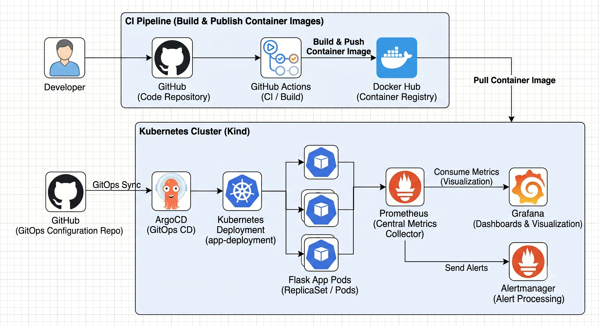
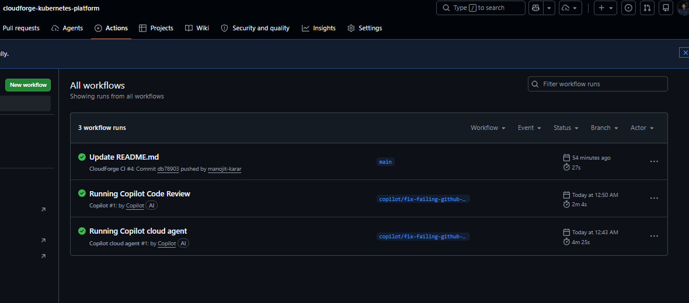
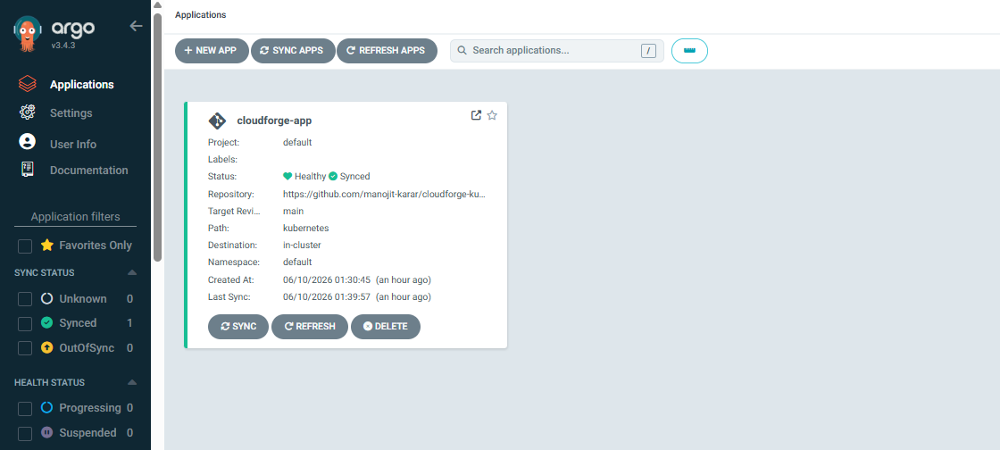
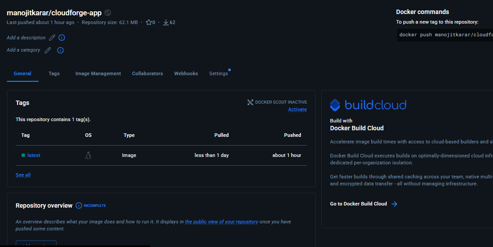
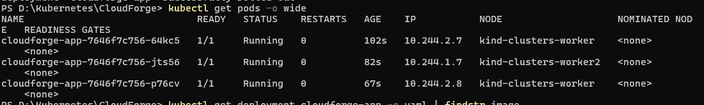
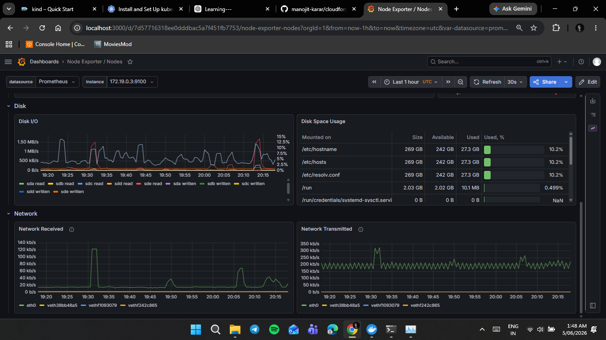
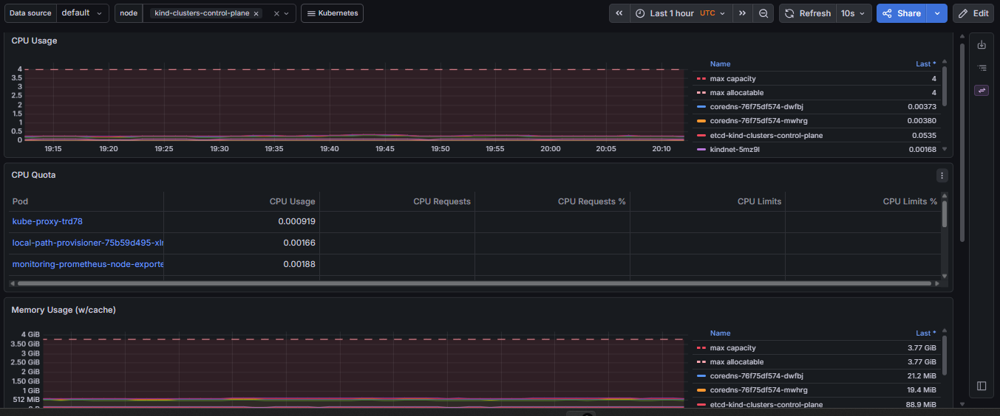

# CloudForge 🚀


<p align="center">
  <h2><strong>Cloud-Native DevOps Platform built with Kubernetes, GitOps, CI/CD, and Observability</strong></h2>
</p>

<p align="center">
  
  
  
  
  
  
  
  
  
</p>

<p align="center">
  
  
  
  
</p>

---

## 📖 Overview

CloudForge is a cloud-native DevOps platform that demonstrates modern software delivery practices using **Kubernetes**, **GitHub Actions**, **Docker Hub**, **ArgoCD**, **Prometheus**, **Grafana**, and **Alertmanager**.

The project implements an end-to-end automated deployment workflow, enabling containerized applications to move seamlessly from source code to production-ready Kubernetes environments while maintaining observability and GitOps-driven deployment management.

---

## ✨ Key Features

* 🚀 Multi-node Kubernetes cluster using Kind
* 🐳 Containerized Flask application
* ⚙️ GitHub Actions CI pipeline
* 📦 Automated Docker image publishing to Docker Hub
* 🔄 GitOps-based Continuous Delivery using ArgoCD
* 📊 Prometheus monitoring and metrics collection
* 📈 Grafana dashboards and visualization
* 🚨 Alertmanager integration for alert processing
* ♻️ Self-healing Kubernetes workloads
* 🔍 End-to-end observability and monitoring

---

## 🏗️ Architecture

<p align="center">
  
</p>

---

## 🔄 Deployment Workflow

```text
Developer
    │
    ▼
 GitHub Repository
    │
    ▼
 GitHub Actions
    │
(Build & Push Image)
    ▼
 Docker Hub
    │
(Pull Image)
    ▼
 Kubernetes Cluster (Kind)
    ▲
    │
 GitOps Sync
    │
 ArgoCD
```

---

## 🛠️ Tech Stack

| Category               | Technologies      |
| ---------------------- | ----------------- |
| Programming Language   | Python (Flask)    |
| Containerization       | Docker            |
| Container Registry     | Docker Hub        |
| Orchestration          | Kubernetes (Kind) |
| Continuous Integration | GitHub Actions    |
| GitOps                 | ArgoCD            |
| Monitoring             | Prometheus        |
| Visualization          | Grafana           |
| Alerting               | Alertmanager      |
| Version Control        | Git & GitHub      |

---

## 📂 Repository Structure

```text
CloudForge
│
├── app/
│   ├── app.py
│   ├── requirements.txt
│   └── Dockerfile
│
├── kubernetes/
│   ├── deployment.yaml
│   └── service.yaml
│
├── monitoring/
│
├── screenshots/
│   ├── architecture.png
│   ├── github-actions-success.png
│   ├── dockerhub-repository.png
│   ├── argocd-dashboard.png
│   ├── grafana-dashboard.png
│   ├── prometheus-targets.png
│   └── k8s-running-pods.png
│
├── .github/
│   └── workflows/
│       └── ci-cd.yml
│
└── README.md
```

---

## 🚀 CI Pipeline

The Continuous Integration workflow automatically:

* Detects source code changes
* Builds a Docker image
* Publishes the image to Docker Hub

### GitHub Actions Pipeline

<p align="center">
  
</p>

---

## 🔄 GitOps Continuous Delivery

ArgoCD continuously monitors the Git repository and automatically synchronizes Kubernetes resources whenever changes are detected.

### ArgoCD Dashboard

<p align="center">
  
</p>

---

## 📦 Docker Hub Integration

Container images are automatically built and published to Docker Hub through GitHub Actions.

### Docker Hub Repository

<p align="center">
  
</p>

---

## ☸️ Kubernetes Deployment

Application workloads are managed through Kubernetes Deployments and Services.

### Running Pods

<p align="center">
  
</p>

---

## 📊 Monitoring & Observability

CloudForge includes a complete observability stack to monitor infrastructure and application performance.

### Components

| Tool         | Purpose                         |
| ------------ | ------------------------------- |
| Prometheus   | Metrics Collection & Monitoring |
| Grafana      | Visualization & Dashboards      |
| Alertmanager | Alert Routing & Management      |

### Grafana Dashboard

<p align="center">
  
</p>

### Prometheus Targets

<p align="center">
  
</p>

---

## 📈 Project Outcomes

* Automated application build and deployment workflows
* Reduced manual deployment effort using GitOps automation
* Implemented centralized monitoring and observability
* Established automated synchronization between GitHub and Kubernetes
* Built a reproducible cloud-native deployment platform
* Implemented a complete CI/CD and GitOps workflow

---

## 🎯 Skills Demonstrated

* Kubernetes Administration
* Docker Containerization
* GitOps
* Continuous Integration & Delivery
* Monitoring & Observability
* Infrastructure Automation
* Container Orchestration
* Linux Operations
* Cloud-Native Architecture
* DevOps Best Practices

---

## 🏆 Resume Highlights

* Built a cloud-native DevOps platform using Kubernetes, GitHub Actions, Docker Hub, ArgoCD, Prometheus, Grafana, and Alertmanager.
* Implemented GitOps-based deployment automation using ArgoCD.
* Designed an observability stack for infrastructure and application monitoring.
* Automated container build and delivery workflows through GitHub Actions and Docker Hub.
* Deployed and managed containerized workloads in a multi-node Kubernetes environment.

---

## 🚀 Future Enhancements

* Infrastructure provisioning using Terraform
* Helm chart packaging and deployment
* Multi-environment deployments (Dev, Staging, Production)
* AWS EKS migration
* Canary deployments
* Blue-Green deployment strategy
* Advanced alerting integrations

---

## 👨‍💻 Author

**Manojit Karar**

